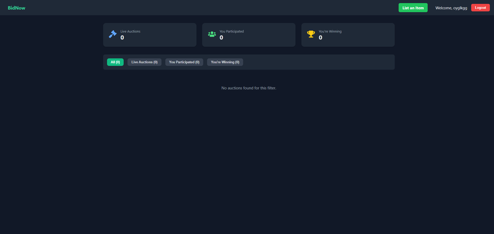
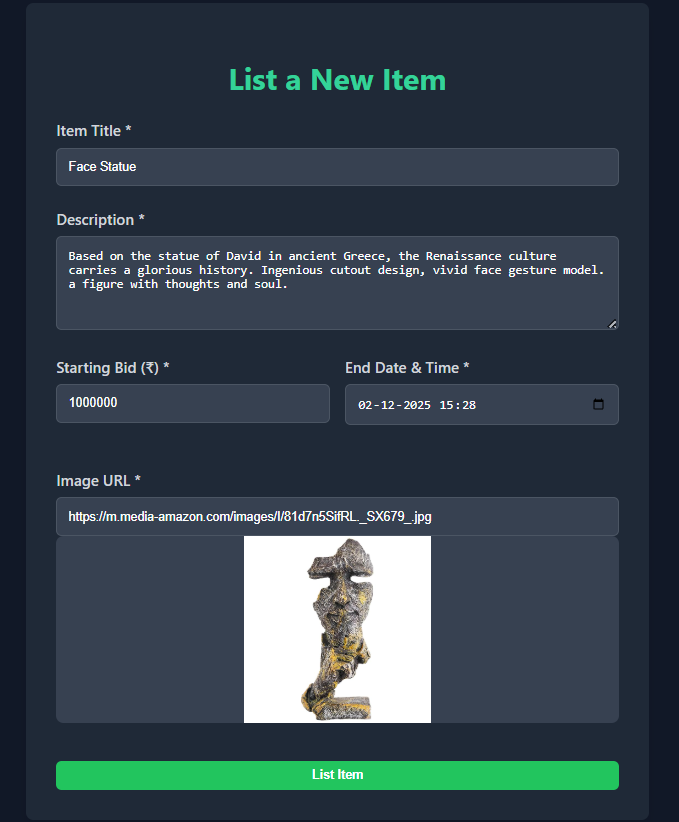
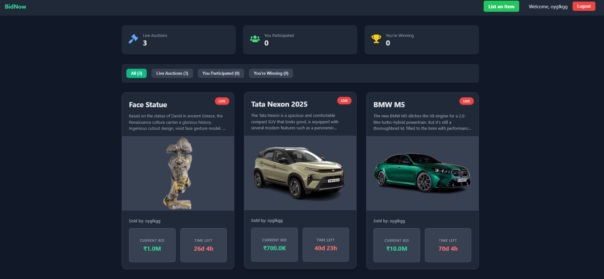
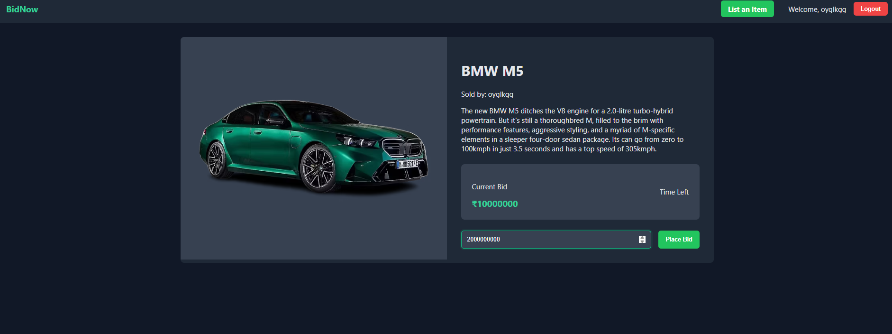

# Realtime Auction Platform

A comprehensive real-time auction platform enabling users to create, bid, and manage auctions with instant updates and secure authentication.

## Tech Stack

- **Frontend:** React.js, Tailwind CSS, Socket.IO Client, Axios
- **Backend:** Node.js, Express.js, MongoDB, Mongoose, Socket.IO, JWT

## Features

- **Live Auction Bidding:** Users can place bids in real time and see instant updates.
- **User Authentication:** Secure registration, login, and logout for all users.
- **Auction Management:** Create new auctions, view active and past auctions, and manage your listings.
- **Responsive UI:** Modern, mobile-friendly design using Tailwind CSS.
- **Live Countdown:** Real-time timers for auction endings.

## Screenshots

### Homepage



### Add Item for Bid



### Homepage After Bid Created



### User Bidding (Name Displayed)



## How It Works

- **Register/Login:** Users sign up and log in securely.
- **Create Auction:** Authenticated users can list new items for auction, specifying details and starting price.
- **Bid in Real Time:** All users see live updates as bids are placed. The highest bid and bidder are instantly visible.
- **Auction End:** When the timer runs out, the highest bidder wins. Auctions are updated in real time for all users.

## Getting Started

### Backend Setup

```bash
cd backend
npm install
npm run dev
```

### Frontend Setup

```bash
cd frontend
npm install
npm start
```

## Environment Variables

Create a `.env` file in the backend directory:

```
MONGODB_URI=your_mongodb_connection_string
JWT_SECRET=your_jwt_secret
PORT=4000
```

## Folder Structure

```
backend/
  ├── config/
  ├── controllers/
  ├── middleware/
  ├── models/
  ├── routes/
  └── server.js

frontend/
  ├── src/
  │   ├── components/
  │   ├── context/
  │   ├── hooks/
  │   ├── pages/
  │   └── services/
  └── public/
      └── images/
          ├── homepage.png
          ├── add_item.png
          ├── homepage_after_bid.png
          └── user_bidding.png

README.md

```


